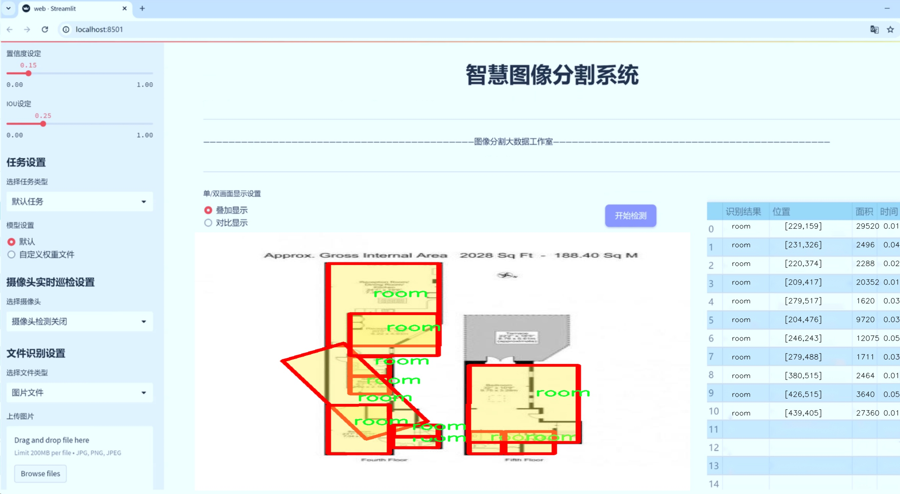
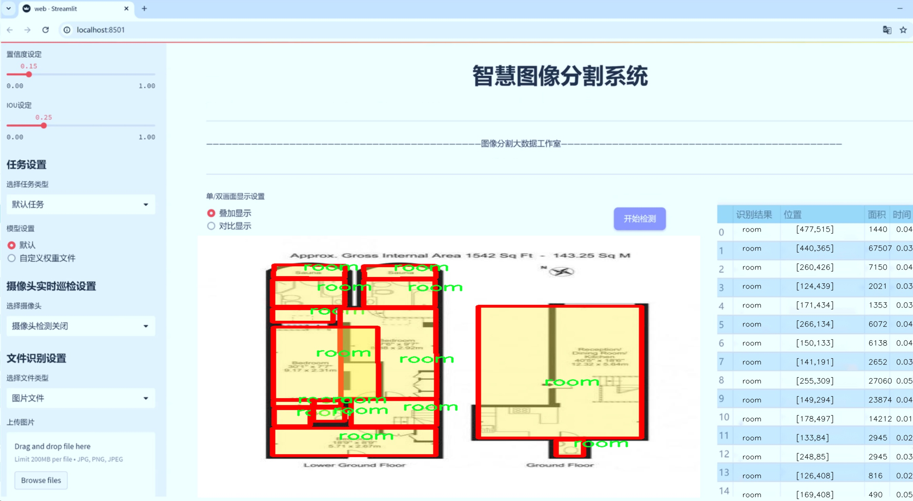
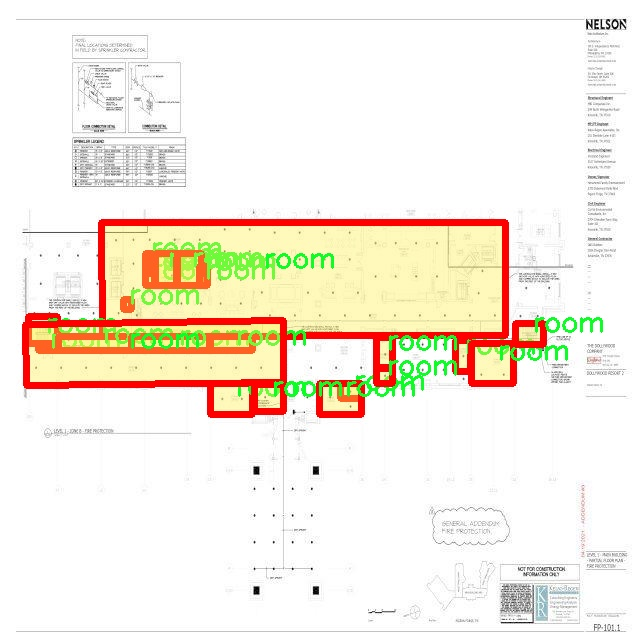
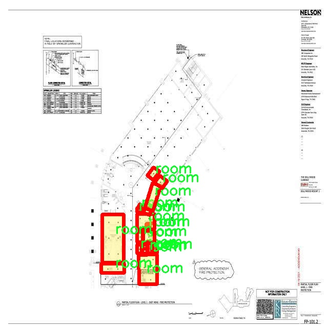
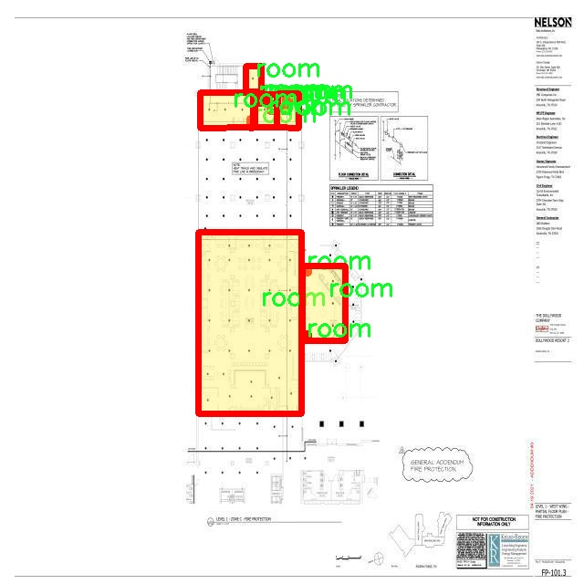
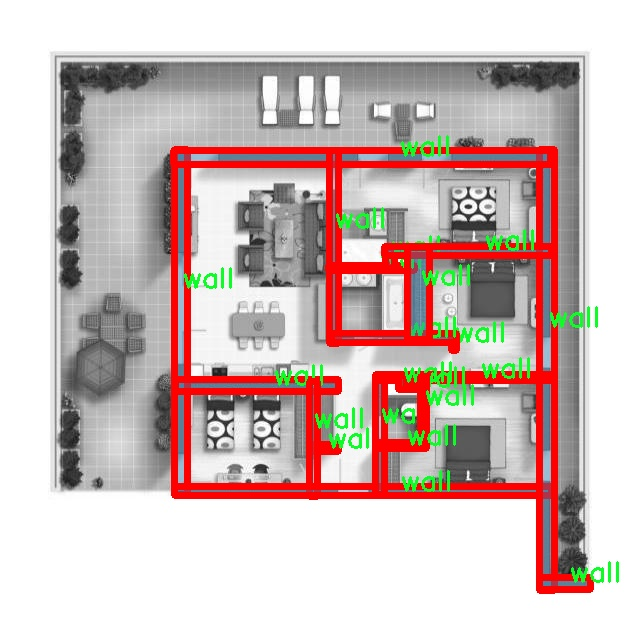
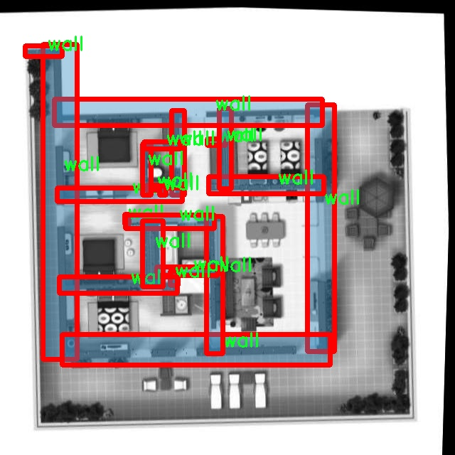

# 建筑平面图室内空间图像分割系统源码＆数据集分享
 [yolov8-seg-C2f-DCNV2-Dynamic＆yolov8-seg-C2f-CloAtt等50+全套改进创新点发刊_一键训练教程_Web前端展示]

### 1.研究背景与意义

项目参考[ILSVRC ImageNet Large Scale Visual Recognition Challenge](https://gitee.com/YOLOv8_YOLOv11_Segmentation_Studio/projects)

项目来源[AAAI Global Al lnnovation Contest](https://kdocs.cn/l/cszuIiCKVNis)

研究背景与意义

随着城市化进程的加快，建筑设计与室内空间规划的复杂性日益增加，如何高效、准确地进行建筑平面图的室内空间图像分割成为了建筑设计、室内装修及智能家居等领域亟待解决的问题。传统的手工标注方法不仅耗时耗力，而且容易受到人为因素的影响，导致分割结果的不一致性和准确性不足。因此，基于深度学习的图像分割技术逐渐成为研究的热点，其中YOLO（You Only Look Once）系列模型因其高效的实时检测能力而受到广泛关注。

YOLOv8作为YOLO系列的最新版本，具备了更强的特征提取能力和更高的检测精度。然而，现有的YOLOv8模型在处理建筑平面图的室内空间图像分割任务时，仍然面临着一些挑战。例如，建筑平面图中存在多种复杂的空间布局和多样化的建筑元素，如墙壁、门窗、楼梯等，这些元素在图像中可能会出现遮挡、重叠等情况，导致模型难以准确识别和分割。此外，建筑平面图的标注数据相对稀缺，且标注质量参差不齐，这也为模型的训练和评估带来了困难。

为了解决上述问题，本研究旨在基于改进的YOLOv8模型，构建一个高效的建筑平面图室内空间图像分割系统。我们将利用包含2500张图像的多类别数据集，该数据集涵盖了12个不同的类别，包括黑墙、交叉墙、门窗、房间、楼梯等，充分反映了建筑平面图的多样性和复杂性。通过对数据集的深入分析与处理，我们将针对不同类别的特征进行优化，提升模型对建筑元素的识别能力。同时，采用数据增强技术，增加训练样本的多样性，以提高模型的泛化能力。

本研究的意义不仅在于提升建筑平面图室内空间图像分割的准确性和效率，更在于推动建筑设计与智能家居领域的数字化转型。通过自动化的图像分割系统，设计师和工程师可以更快速地获取室内空间信息，从而提高设计效率，降低人力成本。此外，该系统还可以为后续的智能家居系统提供基础数据支持，促进智能家居设备的精准布局与配置。

综上所述，基于改进YOLOv8的建筑平面图室内空间图像分割系统的研究，不仅具有重要的理论价值，也具有广泛的应用前景。通过解决当前建筑平面图分割中的技术难题，我们希望能够为相关领域的研究和实践提供新的思路和方法，推动建筑设计与智能家居的进一步发展。

### 2.图片演示






##### 注意：由于此博客编辑较早，上面“2.图片演示”和“3.视频演示”展示的系统图片或者视频可能为老版本，新版本在老版本的基础上升级如下：（实际效果以升级的新版本为准）

  （1）适配了YOLOV8的“目标检测”模型和“实例分割”模型，通过加载相应的权重（.pt）文件即可自适应加载模型。

  （2）支持“图片识别”、“视频识别”、“摄像头实时识别”三种识别模式。

  （3）支持“图片识别”、“视频识别”、“摄像头实时识别”三种识别结果保存导出，解决手动导出（容易卡顿出现爆内存）存在的问题，识别完自动保存结果并导出到tempDir中。

  （4）支持Web前端系统中的标题、背景图等自定义修改，后面提供修改教程。

  另外本项目提供训练的数据集和训练教程,暂不提供权重文件（best.pt）,需要您按照教程进行训练后实现图片演示和Web前端界面演示的效果。

### 3.视频演示

[3.1 视频演示](https://www.bilibili.com/video/BV1A8SbYDEbu/)

### 4.数据集信息展示

##### 4.1 本项目数据集详细数据（类别数＆类别名）

nc: 6
names: ['door or window', 'doors', 'room', 'room or window', 'wall', 'window']


##### 4.2 本项目数据集信息介绍

数据集信息展示

在本研究中，我们构建了一个专门用于训练改进YOLOv8-seg的建筑平面图室内空间图像分割系统的数据集，命名为“all”。该数据集的设计旨在涵盖建筑室内空间中常见的元素，以提高模型在实际应用中的表现和准确性。数据集包含六个类别，分别为“door or window”、“doors”、“room”、“room or window”、“wall”和“window”。这些类别的选择不仅反映了建筑平面图的基本构成要素，也为模型提供了丰富的上下文信息，以便更好地理解和分割室内空间。

首先，数据集中“door or window”这一类别的存在，旨在帮助模型识别出那些既可以被视为门也可以被视为窗户的结构。这一类别的模糊性反映了建筑设计中的复杂性，模型需要具备一定的灵活性来处理这种情况。其次，“doors”类别专注于门的具体识别，能够帮助系统准确定位室内空间的出入口，进而为后续的空间利用和流线分析提供支持。

“room”类别则是数据集的核心，代表了建筑平面图中的各个房间。该类别的标注不仅包括房间的边界，还涵盖了房间内部的结构特征，使得模型能够更好地理解房间的功能和布局。此外，“room or window”类别则为模型提供了额外的上下文信息，帮助其在某些情况下区分房间与窗户的关系，尤其是在光线和视野影响下的场景中。

在数据集的构建过程中，“wall”类别的引入至关重要。墙体是建筑空间的基本构成部分，准确识别墙体的存在与位置，对于理解空间的整体布局和功能至关重要。墙体的标注不仅帮助模型理解空间的分隔，还能在后续的室内导航和空间规划中发挥重要作用。

最后，“window”类别则专注于窗户的识别，窗户在建筑设计中不仅影响室内的光照和通风，还对室内环境的舒适度有着重要影响。通过准确识别窗户，模型能够更好地分析室内空间的自然光照条件，从而为智能建筑设计和环境监测提供数据支持。

整体而言，数据集“all”通过精心设计的六个类别，涵盖了建筑平面图室内空间的关键要素，为改进YOLOv8-seg模型的训练提供了丰富的样本和标注信息。这些类别的多样性和复杂性，不仅提高了模型的分割精度，也为后续的研究和应用奠定了坚实的基础。通过对这些类别的深入分析和学习，模型将能够在实际应用中更好地理解和处理建筑室内空间的图像，从而实现更高效的空间利用和智能化管理。











### 5.全套项目环境部署视频教程（零基础手把手教学）

[5.1 环境部署教程链接（零基础手把手教学）](https://www.bilibili.com/video/BV1jG4Ve4E9t/?vd_source=bc9aec86d164b67a7004b996143742dc)


[5.2 安装Python虚拟环境创建和依赖库安装视频教程链接（零基础手把手教学）](https://www.bilibili.com/video/BV1nA4VeYEze/?vd_source=bc9aec86d164b67a7004b996143742dc)

### 6.手把手YOLOV8-seg训练视频教程（零基础小白有手就能学会）

[6.1 手把手YOLOV8-seg训练视频教程（零基础小白有手就能学会）](https://www.bilibili.com/video/BV1cA4VeYETe/?vd_source=bc9aec86d164b67a7004b996143742dc)


按照上面的训练视频教程链接加载项目提供的数据集，运行train.py即可开始训练



     Epoch   gpu_mem       box       obj       cls    labels  img_size
     1/200     0G   0.01576   0.01955  0.007536        22      1280: 100%|██████████| 849/849 [14:42<00:00,  1.04s/it]
               Class     Images     Labels          P          R     mAP@.5 mAP@.5:.95: 100%|██████████| 213/213 [01:14<00:00,  2.87it/s]
                 all       3395      17314      0.994      0.957      0.0957      0.0843

     Epoch   gpu_mem       box       obj       cls    labels  img_size
     2/200     0G   0.01578   0.01923  0.007006        22      1280: 100%|██████████| 849/849 [14:44<00:00,  1.04s/it]
               Class     Images     Labels          P          R     mAP@.5 mAP@.5:.95: 100%|██████████| 213/213 [01:12<00:00,  2.95it/s]
                 all       3395      17314      0.996      0.956      0.0957      0.0845

     Epoch   gpu_mem       box       obj       cls    labels  img_size
     3/200     0G   0.01561    0.0191  0.006895        27      1280: 100%|██████████| 849/849 [10:56<00:00,  1.29it/s]
               Class     Images     Labels          P          R     mAP@.5 mAP@.5:.95: 100%|███████   | 187/213 [00:52<00:00,  4.04it/s]
                 all       3395      17314      0.996      0.957      0.0957      0.0845


### 7.50+种全套YOLOV8-seg创新点代码加载调参视频教程（一键加载写好的改进模型的配置文件）

[7.1 50+种全套YOLOV8-seg创新点代码加载调参视频教程（一键加载写好的改进模型的配置文件）](https://www.bilibili.com/video/BV1Hw4VePEXv/?vd_source=bc9aec86d164b67a7004b996143742dc)

### 8.YOLOV8-seg图像分割算法原理

原始YOLOV8-seg算法原理

YOLOv8-seg算法是2023年由Ultralytics推出的一款先进的目标检测与分割模型，作为YOLO系列的最新版本，它不仅在目标检测领域取得了显著的进展，还将目标分割的能力融入其中，形成了一个高效且精准的视觉识别系统。YOLOv8-seg的设计理念在于集成和优化前几代YOLO模型的优点，尤其是YOLOX、YOLOv6、YOLOv7和PPYOLOE等算法的成功经验，从而实现实时检测与分割的最佳平衡。

YOLOv8-seg的网络结构主要由四个核心模块组成：输入模块、Backbone骨干网络、Neck特征融合网络和Head检测模块。输入模块负责对输入图像进行预处理，包括图像的缩放、增强和填充等操作。通过Mosaic数据增强技术，YOLOv8-seg能够在训练过程中生成多样化的图像样本，从而提高模型的鲁棒性和泛化能力。此外，输入模块还采用自适应缩放策略，以确保不同尺寸的目标都能被有效检测和分割。

在Backbone骨干网络中，YOLOv8-seg沿用了DarkNet结构，但进行了重要的改进。特别是，C2f模块取代了传统的C3模块，这一变化旨在增强特征提取的能力，提升网络对复杂场景的适应性。C2f模块通过优化的卷积操作和特征融合策略，确保了更丰富的梯度流动信息得以保留，从而使得网络在提取图像特征时更加高效。此外，SPPF模块的引入使得特征图的处理更加灵活，通过不同内核尺寸的池化操作，YOLOv8-seg能够有效合并特征图，增强对多尺度目标的检测能力。

Neck特征融合网络采用了“双塔结构”，结合了特征金字塔网络（FPN）和路径聚合网络（PAN），这使得语义特征和定位特征之间的转移更加顺畅。通过这种结构，YOLOv8-seg能够在不同尺度上提取和融合特征，进而提高对目标的检测精度和分割效果。尤其是在复杂的背景和多样化的目标场景中，Neck模块的设计显著增强了网络的特征融合能力，使得YOLOv8-seg在处理小目标和复杂目标时表现出色。

在Head检测模块中，YOLOv8-seg采用了解耦头结构，将分类和回归过程分离开来。这一设计的主要优势在于加速了模型的收敛速度，并提高了检测精度。通过引入Task-Aligned Assigner方法，YOLOv8-seg能够对分类分数和回归分数进行加权匹配，从而优化正负样本的匹配过程。损失计算方面，YOLOv8-seg结合了二元交叉熵损失（BCE）和分布焦点损失（DFL），并使用完整交并比损失（CIoU）来提高模型的泛化能力和精确度。

YOLOv8-seg的创新之处在于其引入了anchor-free的检测策略，这一策略相较于传统的anchor-based方法，能够显著提高检测精度和速度。这一变化使得YOLOv8-seg在处理复杂场景时，尤其是在水面等动态环境中，能够更好地应对小目标的检测和定位问题。尽管如此，在某些特定环境下，YOLOv8-seg仍可能面临定位误差和目标感知能力不足的挑战。因此，针对这些问题，研究者们提出了YOLOv8-WSSOD算法的改进方案，旨在进一步提升YOLOv8-seg的性能。

总的来说，YOLOv8-seg算法的原理在于通过先进的网络结构和优化策略，实现高效的目标检测与分割。其在苹果采摘等实际应用中的表现，充分展示了YOLOv8-seg在农业自动化和智能机器人领域的潜力。通过结合视觉识别能力与路径规划算法，YOLOv8-seg不仅为目标检测提供了新的思路，也为未来的研究和应用开辟了广阔的前景。随着技术的不断进步，YOLOv8-seg无疑将在目标检测和分割领域继续引领潮流，推动相关技术的快速发展。


### 9.系统功能展示（检测对象为举例，实际内容以本项目数据集为准）

图9.1.系统支持检测结果表格显示

  图9.2.系统支持置信度和IOU阈值手动调节

  图9.3.系统支持自定义加载权重文件best.pt(需要你通过步骤5中训练获得)

  图9.4.系统支持摄像头实时识别

  图9.5.系统支持图片识别

  图9.6.系统支持视频识别

  图9.7.系统支持识别结果文件自动保存

  图9.8.系统支持Excel导出检测结果数据


### 10.50+种全套YOLOV8-seg创新点原理讲解（非科班也可以轻松写刊发刊，V11版本正在科研待更新）

#### 10.1 由于篇幅限制，每个创新点的具体原理讲解就不一一展开，具体见下列网址中的创新点对应子项目的技术原理博客网址【Blog】：


[10.1 50+种全套YOLOV8-seg创新点原理讲解链接](https://gitee.com/qunmasj/good)

#### 10.2 部分改进模块原理讲解(完整的改进原理见上图和技术博客链接)【如果此小节的图加载失败可以通过CSDN或者Github搜索该博客的标题访问原始博客，原始博客图片显示正常】
### YOLOv8简介
#### Yolov8网络模型
Yolov8n的网络分为输入端、主干网( Back-bone) 、Neck模块和输出端4个部分（图4)。输
人端主要有马赛克( Mosaic）数据增强、自适应锚框计算和自适应灰度填充。主干网有Conv、C2和SPPF结构，其中，C2r模块是对残差特征进行学习的主要模块，该模块仿照Yolov7的ELAN结构,通过更多的分支跨层连接，丰富了模型的梯度流，可形成一个具有更强特征表示能力的神经网络模
块。Neck模块采用PAN ( path aggregation nelwOrk ,结构，可加强网络对不同缩放尺度对象特征融合的
能力。输出端将分类和检测过程进行解耦，主要包括损失计算和目标检测框筛选，其中，损失计算过程主要包括正负样本分配策略和 Loss计算，Yolov8n 网络主要使用TaskAlignedAssignerl 10]方法，即根据分类与回归的分数加权结果选择正样本;Loss计算包括分类和回归2个分支，无Ob-jecIness分支。分类分支依然采用BCE Loss，回归分支则使用了Distribution Focal Loss!11〕和CIOU( complele inlersection over union)损失函数。

### 可扩张残差（DWR）注意力模块
当前的许多工作直接采用多速率深度扩张卷积从一个输入特征图中同时捕获多尺度上下文信息，从而提高实时语义分割的特征提取效率。 然而，这种设计可能会因为结构和超参数的不合理而导致多尺度上下文信息的访问困难。 为了降低绘制多尺度上下文信息的难度，我们提出了一种高效的多尺度特征提取方法，该方法分解了原始的单步特征提取方法方法分为两个步骤，区域残差-语义残差。 在该方法中，多速率深度扩张卷积在特征提取中发挥更简单的作用：根据第一步提供的每个简明区域形式特征图，在第二步中使用一个所需的感受野执行简单的基于语义的形态过滤 一步，提高他们的效率。 此外，扩张率和扩张卷积的容量每个网络阶段都经过精心设计，以充分利用所有可以实现的区域形式的特征图。 因此，我们分别为高层和低层网络设计了一种新颖的扩张式残差（DWR）模块和简单倒置残差（SIR）模块。


首先，该博客引入了一个Dilation-wise Residual（DWR）模块，用于提取网络高层的特征，如图2a所示。多分支结构用于扩展感受野，其中每个分支采用不同空洞率的空洞深度卷积。
然后，专门设计了一个Simple Inverted Residual（SIR）模块来提取网络低层的特征，如图2b所示。该模块仅具有3×3的微小感受野，但使用inverted bottleneck式结构来扩展通道数量，确保更强的特征提取能力。
最后，基于DWR和SIR模块，构建了一个编码器-解码器风格的网络DWRSeg，其中解码器采用了简单的类似FCN的结构。解码器使用来自最后两个阶段的强语义信息直接对特征图进行上采样，然后将它们与来自较低阶段的特征图（包含丰富的详细信息）拼接起来，以进行最终预测。


### 11.项目核心源码讲解（再也不用担心看不懂代码逻辑）

#### 11.1 ultralytics\utils\callbacks\wb.py

以下是代码中最核心的部分，并附上详细的中文注释：

```python
# 导入必要的库
from ultralytics.utils import SETTINGS, TESTS_RUNNING
from ultralytics.utils.torch_utils import model_info_for_loggers

try:
    # 确保当前不是在测试环境中
    assert not TESTS_RUNNING  
    # 确保WandB集成已启用
    assert SETTINGS['wandb'] is True  
    import wandb as wb  # 导入WandB库

    # 确保WandB库正确安装
    assert hasattr(wb, '__version__')  

    import numpy as np  # 导入NumPy库
    import pandas as pd  # 导入Pandas库

    _processed_plots = {}  # 用于存储已处理的图表

except (ImportError, AssertionError):
    wb = None  # 如果导入失败或断言失败，则将wb设置为None


def _custom_table(x, y, classes, title='Precision Recall Curve', x_title='Recall', y_title='Precision'):
    """
    创建并记录自定义指标可视化到wandb.plot.pr_curve。

    该函数生成一个自定义指标可视化，模仿WandB默认的精确度-召回曲线，同时允许增强的自定义。
    该可视化指标用于监控模型在不同类别上的性能。

    参数:
        x (List): x轴的值，长度为N。
        y (List): y轴的对应值，长度也为N。
        classes (List): 每个点的类别标签，长度为N。
        title (str, optional): 图表标题，默认为'Precision Recall Curve'。
        x_title (str, optional): x轴标签，默认为'Recall'。
        y_title (str, optional): y轴标签，默认为'Precision'。

    返回:
        (wandb.Object): 适合记录的wandb对象，展示生成的指标可视化。
    """
    # 创建数据框
    df = pd.DataFrame({'class': classes, 'y': y, 'x': x}).round(3)
    fields = {'x': 'x', 'y': 'y', 'class': 'class'}
    string_fields = {'title': title, 'x-axis-title': x_title, 'y-axis-title': y_title}
    # 返回WandB表格可视化对象
    return wb.plot_table('wandb/area-under-curve/v0',
                         wb.Table(dataframe=df),
                         fields=fields,
                         string_fields=string_fields)


def _plot_curve(x, y, names=None, id='precision-recall', title='Precision Recall Curve', x_title='Recall', y_title='Precision', num_x=100, only_mean=False):
    """
    记录指标曲线可视化。

    该函数根据输入数据生成指标曲线，并将可视化记录到WandB。
    曲线可以表示聚合数据（均值）或单个类别数据，具体取决于'only_mean'标志。

    参数:
        x (np.ndarray): x轴的数据点，长度为N。
        y (np.ndarray): y轴的对应数据点，形状为CxN，其中C表示类别数量。
        names (list, optional): 对应y轴数据的类别名称，长度为C。默认为空列表。
        id (str, optional): 在WandB中记录数据的唯一标识符。默认为'precision-recall'。
        title (str, optional): 可视化图表的标题。默认为'Precision Recall Curve'。
        x_title (str, optional): x轴的标签。默认为'Recall'。
        y_title (str, optional): y轴的标签。默认为'Precision'。
        num_x (int, optional): 可视化的插值数据点数量。默认为100。
        only_mean (bool, optional): 标志，指示是否仅绘制均值曲线。默认为True。

    注意:
        该函数利用'_custom_table'函数生成实际的可视化。
    """
    # 创建新的x轴数据
    if names is None:
        names = []
    x_new = np.linspace(x[0], x[-1], num_x).round(5)

    # 创建用于记录的数组
    x_log = x_new.tolist()
    y_log = np.interp(x_new, x, np.mean(y, axis=0)).round(3).tolist()

    if only_mean:
        # 如果仅绘制均值曲线
        table = wb.Table(data=list(zip(x_log, y_log)), columns=[x_title, y_title])
        wb.run.log({title: wb.plot.line(table, x_title, y_title, title=title)})
    else:
        # 如果绘制所有类别的曲线
        classes = ['mean'] * len(x_log)
        for i, yi in enumerate(y):
            x_log.extend(x_new)  # 添加新的x数据
            y_log.extend(np.interp(x_new, x, yi))  # 将y插值到新的x
            classes.extend([names[i]] * len(x_new))  # 添加类别名称
        wb.log({id: _custom_table(x_log, y_log, classes, title, x_title, y_title)}, commit=False)


def on_fit_epoch_end(trainer):
    """在每个训练周期结束时记录训练指标和模型信息。"""
    wb.run.log(trainer.metrics, step=trainer.epoch + 1)  # 记录当前周期的指标
    # 记录图表
    _log_plots(trainer.plots, step=trainer.epoch + 1)
    _log_plots(trainer.validator.plots, step=trainer.epoch + 1)
    if trainer.epoch == 0:
        # 在第一个周期记录模型信息
        wb.run.log(model_info_for_loggers(trainer), step=trainer.epoch + 1)


def on_train_end(trainer):
    """在训练结束时保存最佳模型作为artifact。"""
    # 记录验证器和训练器的图表
    _log_plots(trainer.validator.plots, step=trainer.epoch + 1)
    _log_plots(trainer.plots, step=trainer.epoch + 1)
    # 创建WandB artifact
    art = wb.Artifact(type='model', name=f'run_{wb.run.id}_model')
    if trainer.best.exists():
        art.add_file(trainer.best)  # 添加最佳模型文件
        wb.run.log_artifact(art, aliases=['best'])  # 记录artifact
    # 记录每个曲线的可视化
    for curve_name, curve_values in zip(trainer.validator.metrics.curves, trainer.validator.metrics.curves_results):
        x, y, x_title, y_title = curve_values
        _plot_curve(
            x,
            y,
            names=list(trainer.validator.metrics.names.values()),
            id=f'curves/{curve_name}',
            title=curve_name,
            x_title=x_title,
            y_title=y_title,
        )
    wb.run.finish()  # 结束WandB运行，确保在仪表板上不再继续运行


# 定义回调函数
callbacks = {
    'on_fit_epoch_end': on_fit_epoch_end,
    'on_train_end': on_train_end} if wb else {}
```

### 代码核心部分说明：
1. **WandB集成**：代码首先检查WandB库是否可用，并确保在非测试环境中运行。
2. **自定义可视化**：定义了`_custom_table`和`_plot_curve`函数，用于生成和记录精确度-召回曲线的可视化。
3. **训练过程中的回调**：定义了多个回调函数（如`on_fit_epoch_end`和`on_train_end`），用于在训练的不同阶段记录指标和模型信息。

这个程序文件是一个用于与WandB（Weights and Biases）集成的回调函数模块，主要用于在训练过程中记录和可视化模型的性能指标。文件的开头部分导入了一些必要的库和模块，并进行了环境检查，确保在非测试环境下且WandB集成已启用。

在文件中，首先定义了一个私有函数`_custom_table`，该函数用于创建和记录一个自定义的精确度-召回曲线（Precision-Recall Curve）的可视化。它接受一系列参数，包括x轴和y轴的数据、类别标签以及图表的标题等。该函数使用Pandas库将数据整理成表格格式，并利用WandB的API生成可视化图表。

接下来，定义了另一个私有函数`_plot_curve`，该函数用于记录一个指标曲线的可视化。它可以处理多个类别的数据，并根据`only_mean`参数决定是绘制所有类别的曲线还是仅绘制平均曲线。函数内部使用NumPy进行插值计算，以生成平滑的曲线，并通过调用`_custom_table`函数进行可视化。

然后，定义了一个私有函数`_log_plots`，该函数用于记录输入字典中的图表，确保在指定的步骤中没有重复记录相同的图表。

接下来是几个回调函数，分别在不同的训练阶段被调用。`on_pretrain_routine_start`函数在预训练开始时被调用，用于初始化WandB项目。`on_fit_epoch_end`函数在每个训练周期结束时记录训练指标和模型信息。`on_train_epoch_end`函数在每个训练周期结束时记录损失和学习率，并在特定条件下记录图表。`on_train_end`函数在训练结束时保存最佳模型，并记录验证指标的曲线。

最后，文件中定义了一个字典`callbacks`，将上述回调函数与相应的事件关联起来，以便在训练过程中自动调用这些函数。整个模块的设计旨在通过WandB提供的可视化和记录功能，帮助用户更好地监控和分析模型的训练过程。

#### 11.2 ultralytics\hub\session.py

以下是经过简化和注释的核心代码部分：

```python
import signal
import sys
from time import sleep
import requests
from ultralytics.hub.utils import HUB_API_ROOT, HUB_WEB_ROOT, smart_request
from ultralytics.utils import LOGGER, checks
from ultralytics.utils.errors import HUBModelError

class HUBTrainingSession:
    """
    HUBTrainingSession类用于处理Ultralytics HUB YOLO模型的训练会话。
    包括模型初始化、心跳监测和检查点上传等功能。
    """

    def __init__(self, url):
        """
        初始化HUBTrainingSession，设置模型标识符。

        参数:
            url (str): 用于初始化HUB训练会话的模型标识符。
        """
        # 解析输入的模型URL
        if url.startswith(f'{HUB_WEB_ROOT}/models/'):
            url = url.split(f'{HUB_WEB_ROOT}/models/')[-1]
        if [len(x) for x in url.split('_')] == [42, 20]:
            key, model_id = url.split('_')  # 提取密钥和模型ID
        elif len(url) == 20:
            key, model_id = '', url  # 只有模型ID
        else:
            raise HUBModelError(f"model='{url}' not found. Check format is correct.")

        # 授权
        auth = Auth(key)
        self.model_id = model_id
        self.model_url = f'{HUB_WEB_ROOT}/models/{model_id}'
        self.api_url = f'{HUB_API_ROOT}/v1/models/{model_id}'
        self.auth_header = auth.get_auth_header()
        self.alive = True  # 心跳状态
        self._start_heartbeat()  # 启动心跳监测
        self._register_signal_handlers()  # 注册信号处理器

    def _register_signal_handlers(self):
        """注册信号处理器以优雅地处理终止信号。"""
        signal.signal(signal.SIGTERM, self._handle_signal)
        signal.signal(signal.SIGINT, self._handle_signal)

    def _handle_signal(self, signum, frame):
        """处理终止信号，停止心跳监测。"""
        if self.alive:
            LOGGER.info('Kill signal received! ❌')
            self._stop_heartbeat()
            sys.exit(signum)

    def _stop_heartbeat(self):
        """终止心跳监测。"""
        self.alive = False

    def upload_metrics(self):
        """上传模型的性能指标到Ultralytics HUB。"""
        payload = {'metrics': self.metrics_queue.copy(), 'type': 'metrics'}
        smart_request('post', self.api_url, json=payload, headers=self.auth_header)

    def _get_model(self):
        """从Ultralytics HUB获取并返回模型数据。"""
        api_url = f'{HUB_API_ROOT}/v1/models/{self.model_id}'
        try:
            response = smart_request('get', api_url, headers=self.auth_header)
            data = response.json().get('data', None)
            return data
        except requests.exceptions.ConnectionError:
            raise ConnectionRefusedError('ERROR: The HUB server is not online.')

    @threaded
    def _start_heartbeat(self):
        """开始一个线程的心跳循环，向Ultralytics HUB报告代理状态。"""
        while self.alive:
            smart_request('post',
                          f'{HUB_API_ROOT}/v1/agent/heartbeat/models/{self.model_id}',
                          json={'agent': AGENT_NAME},
                          headers=self.auth_header)
            sleep(300)  # 每300秒发送一次心跳
```

### 代码注释说明：
1. **类定义**：`HUBTrainingSession`类负责管理与Ultralytics HUB的训练会话。
2. **初始化方法**：在构造函数中解析模型的URL，设置相关属性，并启动心跳监测。
3. **信号处理**：注册信号处理器以处理终止信号，确保在接收到信号时能够优雅地停止心跳监测。
4. **上传指标**：`upload_metrics`方法用于将模型的性能指标上传到Ultralytics HUB。
5. **获取模型**：`_get_model`方法从HUB获取模型数据，处理网络请求异常。
6. **心跳监测**：`_start_heartbeat`方法在一个独立线程中定期向HUB发送心跳请求，以报告代理的状态。

这个程序文件是Ultralytics YOLO模型的一个训练会话管理类，主要用于处理模型的初始化、心跳信号和检查点上传等功能。首先，程序导入了一些必要的库和模块，包括信号处理、系统操作、路径处理、时间控制以及HTTP请求等。

在类`HUBTrainingSession`的构造函数中，首先解析传入的模型标识符`url`，支持通过URL或特定格式的模型键来初始化。如果格式不正确，则抛出自定义的`HUBModelError`异常。接着，程序通过`Auth`类进行身份验证，并初始化一些属性，包括代理ID、模型ID、模型的URL、API URL、身份验证头、速率限制、定时器、指标队列和模型数据。初始化完成后，程序启动心跳机制并注册信号处理器，以便在接收到终止信号时能够优雅地关闭。

信号处理器的注册是为了捕捉`SIGTERM`和`SIGINT`信号，确保在程序终止时能够停止心跳信号的发送。心跳机制是一个线程循环，定期向Ultralytics HUB报告代理的状态。程序还提供了上传模型指标和模型检查点的功能，分别通过`upload_metrics`和`upload_model`方法实现。

在`_get_model`方法中，程序通过API请求获取模型数据，处理不同状态的模型，包括新模型和正在训练的模型，并根据返回的数据设置训练参数和模型文件。如果在请求过程中发生连接错误，会抛出相应的异常。

总的来说，这个程序文件实现了与Ultralytics HUB的交互，支持模型的训练过程管理、状态报告和数据上传等功能，确保用户能够方便地进行YOLO模型的训练和监控。

#### 11.3 ultralytics\nn\modules\transformer.py

以下是代码中最核心的部分，并附上详细的中文注释：

```python
import torch
import torch.nn as nn
import torch.nn.functional as F

class TransformerEncoderLayer(nn.Module):
    """定义一个Transformer编码器层。"""

    def __init__(self, c1, cm=2048, num_heads=8, dropout=0.0, act=nn.GELU(), normalize_before=False):
        """初始化TransformerEncoderLayer，设置参数。
        
        参数:
        - c1: 输入特征的维度。
        - cm: 前馈网络中间层的维度。
        - num_heads: 多头注意力机制中的头数。
        - dropout: dropout的比率。
        - act: 激活函数，默认为GELU。
        - normalize_before: 是否在前向传播前进行归一化。
        """
        super().__init__()
        self.ma = nn.MultiheadAttention(c1, num_heads, dropout=dropout, batch_first=True)  # 多头注意力层
        self.fc1 = nn.Linear(c1, cm)  # 前馈网络的第一层
        self.fc2 = nn.Linear(cm, c1)  # 前馈网络的第二层

        self.norm1 = nn.LayerNorm(c1)  # 第一层归一化
        self.norm2 = nn.LayerNorm(c1)  # 第二层归一化
        self.dropout = nn.Dropout(dropout)  # dropout层
        self.dropout1 = nn.Dropout(dropout)  # 第一层dropout
        self.dropout2 = nn.Dropout(dropout)  # 第二层dropout

        self.act = act  # 激活函数
        self.normalize_before = normalize_before  # 是否在前向传播前进行归一化

    def forward(self, src, src_mask=None, src_key_padding_mask=None, pos=None):
        """通过编码器模块进行前向传播。
        
        参数:
        - src: 输入特征。
        - src_mask: 注意力掩码。
        - src_key_padding_mask: 填充掩码。
        - pos: 位置编码。
        
        返回:
        - 经过编码器层处理后的特征。
        """
        if self.normalize_before:
            src2 = self.norm1(src)  # 先进行归一化
            q = k = src2 + (pos if pos is not None else 0)  # 添加位置编码
            src2 = self.ma(q, k, value=src2, attn_mask=src_mask, key_padding_mask=src_key_padding_mask)[0]
            src = src + self.dropout1(src2)  # 残差连接
            src2 = self.norm2(src)  # 再次归一化
            src2 = self.fc2(self.dropout(self.act(self.fc1(src2))))  # 前馈网络
            return src + self.dropout2(src2)  # 返回结果
        else:
            q = k = src + (pos if pos is not None else 0)  # 添加位置编码
            src2 = self.ma(q, k, value=src, attn_mask=src_mask, key_padding_mask=src_key_padding_mask)[0]
            src = src + self.dropout1(src2)  # 残差连接
            src = self.norm1(src)  # 归一化
            src2 = self.fc2(self.dropout(self.act(self.fc1(src))))  # 前馈网络
            return self.norm2(src + self.dropout2(src2))  # 返回结果

class MLPBlock(nn.Module):
    """实现一个多层感知机（MLP）块。"""

    def __init__(self, embedding_dim, mlp_dim, act=nn.GELU):
        """初始化MLPBlock，设置嵌入维度、MLP维度和激活函数。
        
        参数:
        - embedding_dim: 输入嵌入的维度。
        - mlp_dim: MLP中间层的维度。
        - act: 激活函数，默认为GELU。
        """
        super().__init__()
        self.lin1 = nn.Linear(embedding_dim, mlp_dim)  # 第一层线性变换
        self.lin2 = nn.Linear(mlp_dim, embedding_dim)  # 第二层线性变换
        self.act = act()  # 激活函数实例化

    def forward(self, x: torch.Tensor) -> torch.Tensor:
        """进行MLP块的前向传播。
        
        参数:
        - x: 输入张量。
        
        返回:
        - 经过MLP处理后的输出张量。
        """
        return self.lin2(self.act(self.lin1(x)))  # 前向传播

class DeformableTransformerDecoderLayer(nn.Module):
    """可变形Transformer解码器层。"""

    def __init__(self, d_model=256, n_heads=8, d_ffn=1024, dropout=0., act=nn.ReLU(), n_levels=4, n_points=4):
        """初始化DeformableTransformerDecoderLayer，设置参数。
        
        参数:
        - d_model: 输入特征的维度。
        - n_heads: 多头注意力的头数。
        - d_ffn: 前馈网络的维度。
        - dropout: dropout的比率。
        - act: 激活函数，默认为ReLU。
        - n_levels: 多尺度的层数。
        - n_points: 每个层的采样点数。
        """
        super().__init__()
        self.self_attn = nn.MultiheadAttention(d_model, n_heads, dropout=dropout)  # 自注意力层
        self.cross_attn = MSDeformAttn(d_model, n_levels, n_heads, n_points)  # 跨注意力层
        self.linear1 = nn.Linear(d_model, d_ffn)  # 前馈网络的第一层
        self.linear2 = nn.Linear(d_ffn, d_model)  # 前馈网络的第二层
        self.act = act  # 激活函数
        self.dropout1 = nn.Dropout(dropout)  # 自注意力的dropout
        self.dropout2 = nn.Dropout(dropout)  # 跨注意力的dropout
        self.dropout3 = nn.Dropout(dropout)  # 前馈网络的dropout
        self.norm1 = nn.LayerNorm(d_model)  # 自注意力的归一化
        self.norm2 = nn.LayerNorm(d_model)  # 跨注意力的归一化
        self.norm3 = nn.LayerNorm(d_model)  # 前馈网络的归一化

    def forward(self, embed, refer_bbox, feats, shapes, padding_mask=None, attn_mask=None, query_pos=None):
        """进行解码器层的前向传播。
        
        参数:
        - embed: 解码器的输入嵌入。
        - refer_bbox: 参考边界框。
        - feats: 特征图。
        - shapes: 特征图的形状。
        - padding_mask: 填充掩码。
        - attn_mask: 注意力掩码。
        - query_pos: 查询位置编码。
        
        返回:
        - 经过解码器层处理后的特征。
        """
        # 自注意力
        q = k = embed + (query_pos if query_pos is not None else 0)  # 添加位置编码
        tgt = self.self_attn(q.transpose(0, 1), k.transpose(0, 1), embed.transpose(0, 1), attn_mask=attn_mask)[0].transpose(0, 1)
        embed = embed + self.dropout1(tgt)  # 残差连接
        embed = self.norm1(embed)  # 归一化

        # 跨注意力
        tgt = self.cross_attn(embed, refer_bbox.unsqueeze(2), feats, shapes, padding_mask)  # 跨注意力计算
        embed = embed + self.dropout2(tgt)  # 残差连接
        embed = self.norm2(embed)  # 归一化

        # 前馈网络
        tgt2 = self.linear2(self.dropout3(self.act(self.linear1(embed))))  # 前馈网络
        return self.norm3(embed + tgt2)  # 返回结果
```

以上代码片段展示了Transformer编码器层、MLP块和可变形Transformer解码器层的核心实现，包含了重要的初始化和前向传播逻辑。每个类都附有详细的中文注释，解释了其功能和参数。

这个程序文件定义了一些与Transformer相关的模块，主要用于实现深度学习中的Transformer架构，特别是在计算机视觉任务中的应用。文件中包含多个类，每个类实现了Transformer的不同部分，包括编码器层、解码器层、注意力机制等。

首先，`TransformerEncoderLayer`类定义了Transformer编码器的单层结构。它包含多头自注意力机制和前馈神经网络。初始化时，可以设置输入特征的维度、隐藏层的维度、头的数量、dropout比率等参数。该类提供了两种前向传播方式：后归一化和前归一化，用户可以根据需要选择。

接下来，`AIFI`类是`TransformerEncoderLayer`的一个扩展，增加了对2D位置嵌入的支持。它在前向传播中构建了一个2D的正弦余弦位置嵌入，并将输入数据进行展平和变换，以适应Transformer的输入格式。

`TransformerLayer`类实现了一个基本的Transformer层，包含了自注意力机制和前馈网络。它通过线性变换来生成查询、键和值，并使用多头注意力机制进行处理。

`TransformerBlock`类则是一个完整的Transformer模块，支持位置嵌入，并且可以通过卷积层调整输入特征的维度。它由多个`TransformerLayer`组成，能够处理更复杂的输入。

`MLPBlock`和`MLP`类实现了多层感知机（MLP），前者是一个单独的MLP块，后者则是一个完整的多层感知机网络，能够进行多层的线性变换和激活。

`LayerNorm2d`类实现了2D层归一化，适用于处理图像数据，能够在每个通道上进行归一化操作。

`MSDeformAttn`类实现了多尺度可变形注意力机制，允许在不同尺度上进行注意力计算，适用于处理复杂的视觉任务。它通过线性层生成采样偏移和注意力权重，并在前向传播中计算最终的输出。

`DeformableTransformerDecoderLayer`和`DeformableTransformerDecoder`类实现了可变形Transformer解码器的层和整体结构。解码器层包含自注意力和交叉注意力机制，并通过前馈网络进行处理。解码器能够根据输入的特征和参考边界框生成输出。

整体来看，这个文件提供了一套完整的Transformer模块实现，适用于计算机视觉任务中的特征提取和处理，支持多种结构和灵活的配置选项，能够满足不同模型的需求。

#### 11.4 utils.py

以下是代码中最核心的部分，并附上详细的中文注释：

```python
import os
import cv2
import pandas as pd
import streamlit as st
from PIL import Image
from QtFusion.path import abs_path

def save_uploaded_file(uploaded_file):
    """
    保存上传的文件到服务器上。

    Args:
        uploaded_file (UploadedFile): 通过Streamlit上传的文件。

    Returns:
        str: 保存文件的完整路径，如果没有文件上传则返回 None。
    """
    # 检查是否有文件上传
    if uploaded_file is not None:
        base_path = "tempDir"  # 定义文件保存的基本路径

        # 如果路径不存在，创建这个路径
        if not os.path.exists(base_path):
            os.makedirs(base_path)
        # 获取文件的完整路径
        file_path = os.path.join(base_path, uploaded_file.name)

        # 以二进制写模式打开文件
        with open(file_path, "wb") as f:
            f.write(uploaded_file.getbuffer())  # 写入文件

        return file_path  # 返回文件路径

    return None  # 如果没有文件上传，返回 None


def concat_results(result, location, confidence, time):
    """
    显示检测结果。

    Args:
        result (str): 检测结果。
        location (str): 检测位置。
        confidence (str): 置信度。
        time (str): 检测用时。

    Returns:
        DataFrame: 包含检测结果的 DataFrame。
    """
    # 创建一个包含这些信息的 DataFrame
    result_data = {
        "识别结果": [result],
        "位置": [location],
        "置信度": [confidence],
        "用时": [time]
    }

    results_df = pd.DataFrame(result_data)  # 将结果数据转换为 DataFrame
    return results_df  # 返回结果 DataFrame


def get_camera_names():
    """
    获取可用摄像头名称列表。

    Returns:
        list: 返回包含“未启用摄像头”和可用摄像头索引号的列表。
    """
    camera_names = ["摄像头检测关闭", "0"]  # 初始化摄像头名称列表
    max_test_cameras = 10  # 定义要测试的最大摄像头数量

    # 测试可用的摄像头
    for i in range(max_test_cameras):
        cap = cv2.VideoCapture(i, cv2.CAP_DSHOW)  # 尝试打开摄像头
        if cap.isOpened() and str(i) not in camera_names:  # 检查摄像头是否成功打开
            camera_names.append(str(i))  # 添加可用摄像头到列表
            cap.release()  # 释放摄像头资源
    if len(camera_names) == 1:
        st.write("未找到可用的摄像头")  # 如果没有找到可用摄像头，输出提示信息
    return camera_names  # 返回摄像头名称列表
```

### 代码说明：
1. **save_uploaded_file**: 该函数用于保存用户通过Streamlit上传的文件到服务器的指定目录中。它会检查是否有文件上传，并在必要时创建保存目录，最后返回保存文件的路径。

2. **concat_results**: 该函数用于将检测结果、位置、置信度和用时等信息整理成一个Pandas DataFrame，以便后续处理和展示。

3. **get_camera_names**: 该函数用于检测可用的摄像头，并返回一个包含可用摄像头索引的列表。如果没有找到可用的摄像头，则会输出相应的提示信息。

这个程序文件 `utils.py` 主要包含了一些实用的函数，用于处理文件上传、显示检测结果、加载默认图片以及获取可用摄像头的名称。

首先，文件导入了一些必要的库，包括 `os`、`cv2`、`pandas`、`streamlit`、`PIL` 和 `QtFusion.path`。这些库提供了文件操作、图像处理、数据处理、网页应用等功能。

在 `save_uploaded_file` 函数中，程序首先检查是否有文件被上传。如果有，它会定义一个基本路径 `tempDir` 用于保存文件。如果该路径不存在，程序会创建这个目录。接着，程序会获取上传文件的完整路径，并以二进制写模式打开文件，将上传的内容写入到指定路径中。最后，函数返回保存文件的完整路径，如果没有文件上传，则返回 `None`。

`concat_results` 函数用于显示检测结果。它接收检测结果、位置、置信度和检测用时作为参数，并将这些信息存储在一个 pandas DataFrame 中。这个 DataFrame 可以方便地用于后续的数据处理或展示。

`load_default_image` 函数用于加载一个默认的图片。它通过 `abs_path` 函数获取默认图片的绝对路径，并使用 `Image.open` 方法打开这个图片，返回一个图片对象。

最后，`get_camera_names` 函数用于获取可用摄像头的名称列表。它初始化一个包含“摄像头检测关闭”和索引“0”的列表，并定义了一个最大测试摄像头数量的限制。通过循环，程序尝试打开每一个索引的摄像头，如果成功打开，则将该索引添加到摄像头名称列表中。若未找到可用的摄像头，程序会在 Streamlit 界面上显示相应的提示信息。

总体而言，这个文件提供了一些基本的工具函数，方便在一个图像处理或视频监控的应用中进行文件管理和设备检测。

### 12.系统整体结构（节选）

### 程序整体功能和构架概括

该程序是一个深度学习框架，主要用于实现和训练Ultralytics YOLO（You Only Look Once）模型，特别是在计算机视觉任务中的应用。程序的整体架构由多个模块组成，每个模块负责特定的功能，确保模型的训练、评估和可视化过程高效且灵活。

- **回调函数模块**（`ultralytics/utils/callbacks/wb.py`）：用于与WandB（Weights and Biases）集成，记录和可视化训练过程中的指标和模型性能。
- **会话管理模块**（`ultralytics/hub/session.py`）：负责与Ultralytics HUB进行交互，管理模型的训练会话，包括状态报告和数据上传。
- **Transformer模块**（`ultralytics/nn/modules/transformer.py`）：实现了Transformer架构的各个组成部分，包括编码器、解码器和注意力机制，适用于计算机视觉任务。
- **实用工具模块**（`utils.py`）：提供了一些基本的工具函数，用于文件上传、检测结果显示、默认图片加载和摄像头检测。

### 文件功能整理表

| 文件路径                                     | 功能描述                                                   |
|----------------------------------------------|----------------------------------------------------------|
| `__init__.py`                               | 初始化包，可能包含包的元数据和导入相关模块。                |
| `ultralytics/utils/callbacks/wb.py`        | 实现与WandB集成的回调函数，用于记录和可视化训练过程中的指标。 |
| `ultralytics/hub/session.py`                | 管理与Ultralytics HUB的会话，处理模型训练状态和数据上传。     |
| `ultralytics/nn/modules/transformer.py`    | 实现Transformer架构的各个模块，包括编码器、解码器和注意力机制。 |
| `utils.py`                                  | 提供实用工具函数，用于文件处理、结果显示、图片加载和摄像头检测。 |

这个表格总结了每个文件的主要功能，帮助理解程序的整体结构和各个模块之间的关系。

注意：由于此博客编辑较早，上面“11.项目核心源码讲解（再也不用担心看不懂代码逻辑）”中部分代码可能会优化升级，仅供参考学习，完整“训练源码”、“Web前端界面”和“50+种创新点源码”以“14.完整训练+Web前端界面+50+种创新点源码、数据集获取”的内容为准。

### 13.图片、视频、摄像头图像分割Demo(去除WebUI)代码

在这个博客小节中，我们将讨论如何在不使用WebUI的情况下，实现图像分割模型的使用。本项目代码已经优化整合，方便用户将分割功能嵌入自己的项目中。
核心功能包括图片、视频、摄像头图像的分割，ROI区域的轮廓提取、类别分类、周长计算、面积计算、圆度计算以及颜色提取等。
这些功能提供了良好的二次开发基础。

### 核心代码解读

以下是主要代码片段，我们会为每一块代码进行详细的批注解释：

```python
import random
import cv2
import numpy as np
from PIL import ImageFont, ImageDraw, Image
from hashlib import md5
from model import Web_Detector
from chinese_name_list import Label_list

# 根据名称生成颜色
def generate_color_based_on_name(name):
    ......

# 计算多边形面积
def calculate_polygon_area(points):
    return cv2.contourArea(points.astype(np.float32))

...
# 绘制中文标签
def draw_with_chinese(image, text, position, font_size=20, color=(255, 0, 0)):
    image_pil = Image.fromarray(cv2.cvtColor(image, cv2.COLOR_BGR2RGB))
    draw = ImageDraw.Draw(image_pil)
    font = ImageFont.truetype("simsun.ttc", font_size, encoding="unic")
    draw.text(position, text, font=font, fill=color)
    return cv2.cvtColor(np.array(image_pil), cv2.COLOR_RGB2BGR)

# 动态调整参数
def adjust_parameter(image_size, base_size=1000):
    max_size = max(image_size)
    return max_size / base_size

# 绘制检测结果
def draw_detections(image, info, alpha=0.2):
    name, bbox, conf, cls_id, mask = info['class_name'], info['bbox'], info['score'], info['class_id'], info['mask']
    adjust_param = adjust_parameter(image.shape[:2])
    spacing = int(20 * adjust_param)

    if mask is None:
        x1, y1, x2, y2 = bbox
        aim_frame_area = (x2 - x1) * (y2 - y1)
        cv2.rectangle(image, (x1, y1), (x2, y2), color=(0, 0, 255), thickness=int(3 * adjust_param))
        image = draw_with_chinese(image, name, (x1, y1 - int(30 * adjust_param)), font_size=int(35 * adjust_param))
        y_offset = int(50 * adjust_param)  # 类别名称上方绘制，其下方留出空间
    else:
        mask_points = np.concatenate(mask)
        aim_frame_area = calculate_polygon_area(mask_points)
        mask_color = generate_color_based_on_name(name)
        try:
            overlay = image.copy()
            cv2.fillPoly(overlay, [mask_points.astype(np.int32)], mask_color)
            image = cv2.addWeighted(overlay, 0.3, image, 0.7, 0)
            cv2.drawContours(image, [mask_points.astype(np.int32)], -1, (0, 0, 255), thickness=int(8 * adjust_param))

            # 计算面积、周长、圆度
            area = cv2.contourArea(mask_points.astype(np.int32))
            perimeter = cv2.arcLength(mask_points.astype(np.int32), True)
            ......

            # 计算色彩
            mask = np.zeros(image.shape[:2], dtype=np.uint8)
            cv2.drawContours(mask, [mask_points.astype(np.int32)], -1, 255, -1)
            color_points = cv2.findNonZero(mask)
            ......

            # 绘制类别名称
            x, y = np.min(mask_points, axis=0).astype(int)
            image = draw_with_chinese(image, name, (x, y - int(30 * adjust_param)), font_size=int(35 * adjust_param))
            y_offset = int(50 * adjust_param)

            # 绘制面积、周长、圆度和色彩值
            metrics = [("Area", area), ("Perimeter", perimeter), ("Circularity", circularity), ("Color", color_str)]
            for idx, (metric_name, metric_value) in enumerate(metrics):
                ......

    return image, aim_frame_area

# 处理每帧图像
def process_frame(model, image):
    pre_img = model.preprocess(image)
    pred = model.predict(pre_img)
    det = pred[0] if det is not None and len(det)
    if det:
        det_info = model.postprocess(pred)
        for info in det_info:
            image, _ = draw_detections(image, info)
    return image

if __name__ == "__main__":
    cls_name = Label_list
    model = Web_Detector()
    model.load_model("./weights/yolov8s-seg.pt")

    # 摄像头实时处理
    cap = cv2.VideoCapture(0)
    while cap.isOpened():
        ret, frame = cap.read()
        if not ret:
            break
        ......

    # 图片处理
    image_path = './icon/OIP.jpg'
    image = cv2.imread(image_path)
    if image is not None:
        processed_image = process_frame(model, image)
        ......

    # 视频处理
    video_path = ''  # 输入视频的路径
    cap = cv2.VideoCapture(video_path)
    while cap.isOpened():
        ret, frame = cap.read()
        ......
```


### 14.完整训练+Web前端界面+50+种创新点源码、数据集获取


# [下载链接：D:\Temporary](D:\Temporary)